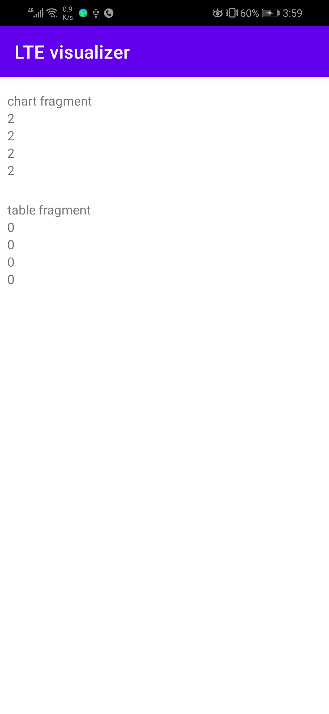

# Milestones screenshots
## 1. Flow of Fetching data and display it in tow fragments
first | second
:-------------------------:|:-------------------------:
 | 
## 2. Basic table rendering
first | second
:-------------------------:|:-------------------------:
 | 
## 3. min requirement for table rendering is done, progress and coloring
first | second
:-------------------------:|:-------------------------:
 | 
## 4. display data in table with correct color and progress
first | second
:-------------------------:|:-------------------------:
 | 
## 5. minimum requirement for line chart, three lines displayed together in different colors
first | second
:-------------------------:|:-------------------------:
 | 
## 6. Fetching data from the server instead of mocking it, update x-axis to hold time information
first | second
:-------------------------:|:-------------------------:
 | 